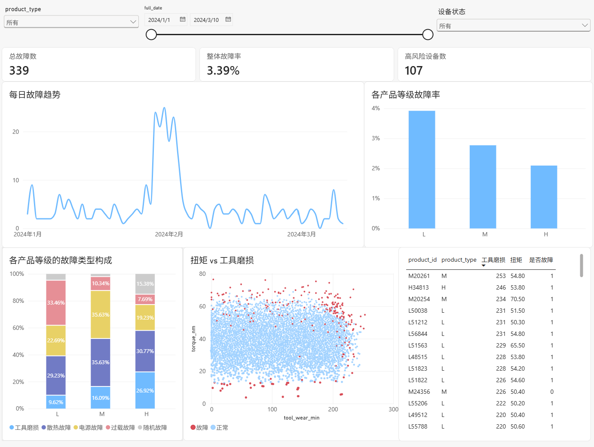

# Industrial Equipment Failure Analytics

基于 **AI4I 2020 Predictive Maintenance Dataset**，使用 **MySQL + SQL + Power BI** 构建工业设备故障分析数据仓库与 BI 分析项目。

项目采用 **ODS → DWD → DWS → ADS** 的数据仓库分层架构，对原始工业设备运行数据进行数据加载、清洗、标准化、维度建模和分析数据加工，最终通过 Power BI 构建设备故障分析看板，从时间、产品类型、故障类型、工具磨损、扭矩等多个维度分析设备运行状态及故障情况。

---

## 📌 项目简介

本项目以工业设备预测性维护（Predictive Maintenance）为业务场景，使用 AI4I 2020 Predictive Maintenance Dataset 作为原始数据。

原始数据包含设备编号、产品编号、产品类型、空气温度、过程温度、旋转速度、扭矩、工具磨损以及机器故障和具体故障类型等信息。

项目从原始 CSV 数据开始，使用 MySQL 建立数据仓库，并按照 ODS、DWD、DWS、ADS 进行分层处理。

---

## 📂 项目目录

```text
industrial_supply_chain_sales_analytics/
│
├── datasets/
│   └── ai4i2020.csv
│
├── docs/
│   └── 数据流向图.drawio.png
│
├── scripts/
│   │
│   ├── ods/
│   │   ├── ods_create_machine_raw.sql
│   │   └── ods_insert_machine_raw.sql
│   │
│   ├── dwd/
│   │   ├── dwd_create_machine_clean.sql
│   │   └── dwd_insert_machine_clean.sql
│   │
│   ├── dws/
│   │   ├── dwd_dim_product.sql
│   │   ├── dws_dim_date.sql
│   │   ├── dws_dim_failure_type.sql
│   │   └── dws_fact_equipment_log.sql
│   │
│   └── ads/
│       └── ads_machine_analysis.sql
│
├── BI/
│   └── 设备故障分析看板.png
│
├── LICENSE
│
└── README.md
```

---

## 🛠️ 技术栈

| 技术 | 用途 |
|---|---|
| MySQL | 数据仓库建设、数据存储及数据处理 |
| SQL | 数据加载、数据清洗、数据转换、维度建模及数据关联 |
| Power BI | 数据可视化及 Dashboard 构建 |
| CSV | 原始数据存储 |
| Draw.io | 数据仓库架构及数据流向图绘制 |
| Git / GitHub | 项目版本管理与代码托管 |

---

## 🏗️ 数据仓库架构

本项目采用经典的：

```text
ODS → DWD → DWS → ADS
```

数据仓库分层架构。

```text
                    AI4I 2020 Dataset
                            │
                            ▼
                ┌──────────────────────┐
                │         ODS          │
                │      原始数据层       │
                │                      │
                │   ods_machine_raw    │
                └──────────────────────┘
                            │
                            │ 数据清洗
                            │ 数据类型转换
                            │ 字段标准化
                            │ 时间字段构造
                            ▼
                ┌──────────────────────┐
                │         DWD          │
                │      数据明细层       │
                │                      │
                │  dwd_machine_clean   │
                └──────────────────────┘
                            │
                            │ 维度建模
                            │ 事实表构建
                            ▼
                ┌──────────────────────┐
                │         DWS          │
                │      数据服务层       │
                │                      │
                │   dim_product        │
                │   dim_date           │
                │   dim_failure_type   │
                │   fact_equipment_log │
                └──────────────────────┘
                            │
                            │ 分析数据加工
                            ▼
                ┌──────────────────────┐
                │         ADS          │
                │      应用数据层       │
                │                      │
                │  ads_machine_analysis│
                └──────────────────────┘
                            │
                            ▼
                ┌──────────────────────┐
                │       Power BI       │
                │                      │
                │   设备故障分析看板    │
                └──────────────────────┘
```

---

# 🖥️ BI分析



Power BI 主要展示：

**核心指标包括：**

- 总故障数
- 故障率
- 高风险设备数

**分析内容包括：**

- 每日故障趋势
- 不同产品等级故障率
- 不同产品等级故障类型分析
- 故障类型分布
- 扭矩与工具磨损关系
- 故障设备明细
---

# 📚 数据来源

本项目使用 **AI4I 2020 Predictive Maintenance Dataset**，数据来源于 **Kaggle**。

数据集主要用于工业设备预测性维护（Predictive Maintenance）分析，包含设备运行参数及设备故障信息。

- 数据集名称：AI4I 2020 Predictive Maintenance Dataset
- 数据来源：Kaggle
- 数据文件：`ai4i2020.csv`
- Kaggle 数据集：[Predictive Maintenance Dataset (AI4I 2020)](https://www.kaggle.com/datasets/stephanmatzka/predictive-maintenance-dataset-ai4i-2020)

---
